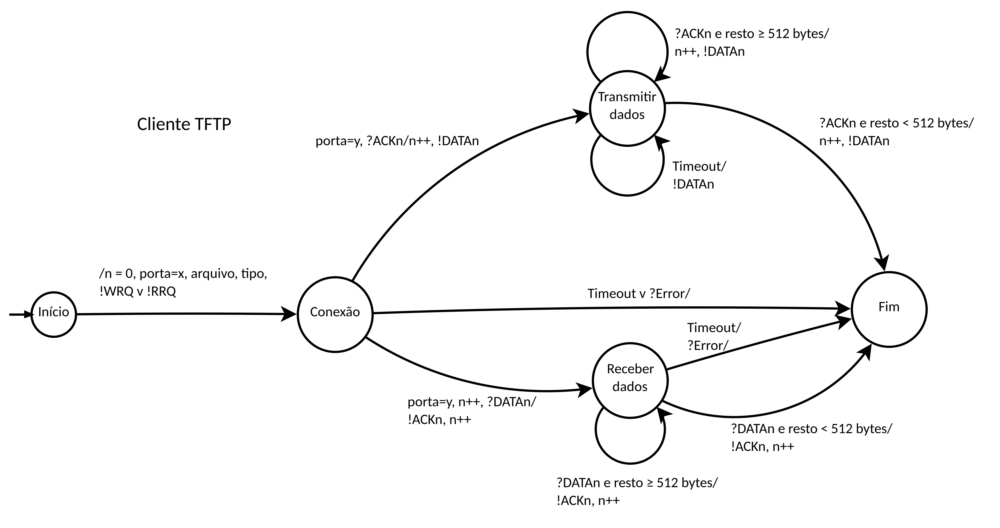

[](https://classroom.github.com/a/Vc7tL63f)
# Protocolo TFTP

## Máquina de estados do cliente TFTP



## Compilação

O cliente TFTP pode ser compilado utilizando o comando abaixo:

```
g++ BaseSocket.cpp UDPSocket.cpp Callback.cpp poller.cpp ACK.cpp DATA.cpp RRQ.cpp WRQ.cpp ERROR.cpp TFTP.cpp cliente.cpp -o cliente
```

## Uso

O uso dá-se da seguinte forma:

```
cliente ip_do_servidor porta operação arquivo_de_origem arquivo_de_destino
```

Por exemplo:

 - Recebendo o arquivo "arquivo-a" do servidor e salvando como "arquivo-b" localmente:

```
cliente 127.0.0.1 6969 receber arquivo-a arquivo-b
```

 - Enviando o arquivo "arquivo-a" e salvando como "arquivo-b" no servidor

```
cliente 127.0.0.1 6969 enviar arquivo-a arquivo-b
```

## Bug

Ao final da execução do programa ocorre o erro:

```
free(): invalid size
```

Isso não impacta no resultado gerado pela aplicação em si, porém a mesma não termina de forma adequada. Um contorno para essa situação foi utilizar a função ```exit(1)``` para terminar o programa em caso de erro.
