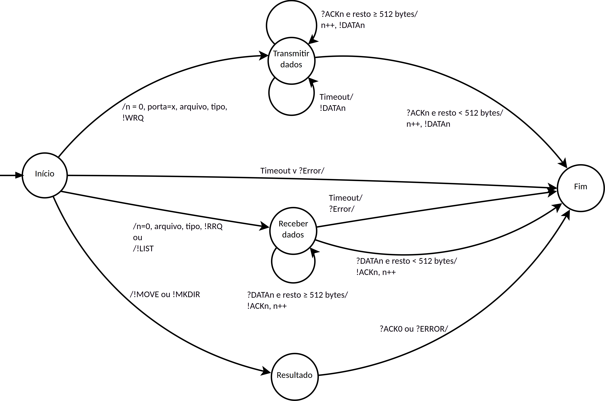
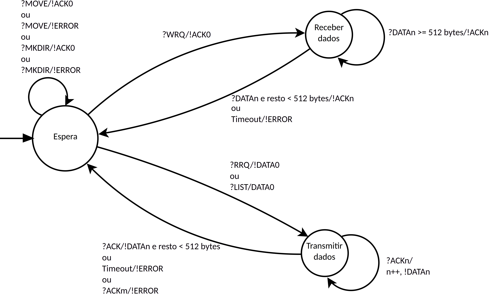

# Protocolo TFTP (versão 2)

## Cliente
### Máquina de estados



### Compilação

O cliente TFTP pode ser compilado utilizando o comando abaixo:

```
git clone https://github.com/jpmsb/ifsc-ptc-2023-2-tftp
cd ifsc-ptc-2023-2-tftp/cliente
make
```

Isso produzirá um binário chamado `cliente` que pode ser executado.

### Uso

O uso dá-se da seguinte forma:

```
cliente <endereço do servidor> <porta> <operação> [arquivo origem] [arquivo destino]
```

A instrução de uso acima também pode ser obtida executando o comando sem nenhum argumento:

```
./cliente

Uso: ./cliente <endereço do servidor> <porta> <operação> [arquivo origem] [arquivo destino]

Operações disponíveis:
                       enviar
                       receber
                       listar (ls)
                       mover (mv)
                       criardir (mkdir)
```

#### Exemplos

 - Recebendo o arquivo "arquivo-a" do servidor e salvando como "arquivo-b" localmente:

    ```
    cliente 127.0.0.1 6969 receber arquivo-a arquivo-b
    ```

 - Enviando o arquivo "arquivo-a" e salvando como "arquivo-b" no servidor

    ```
    cliente 127.0.0.1 6969 enviar arquivo-a arquivo-b
    ```

- Criando um diretório

    ```
    cliente 127.0.0.1 6969 criardir diretorio
    ```

    ou

    ```
    cliente 127.0.0.1 6969 mkdir diretorio
    ```

- Listando os arquivos do diretório raiz

    ```
    cliente 127.0.0.1 6969 listar
    ```
    ou

    ```
    cliente 127.0.0.1 6969 ls
    ```

- Listando os arquivos de um subdiretório

    ```
    cliente 127.0.0.1 6969 listar subdiretorio
    ```
    ou

    ```
    cliente 127.0.0.1 6969 ls subdiretorio
    ```

- Renomeando um arquivo

    ```
    cliente 127.0.0.1 6969 mover arquivo-a arquivo-b
    ```
    ou

    ```
    cliente 127.0.0.1 6969 mv arquivo-a arquivo-b
    ```

- Removendo um arquivo

    ```
    cliente 127.0.0.1 6969 mover arquivo-a
    ```
    ou

    ```
    cliente 127.0.0.1 6969 mv arquivo-a
    ```

## Servidor

### Máquina de estados



### Compilação

O servidor TFTP pode ser compilado utilizando o comando abaixo:

```
git clone https://github.com/jpmsb/ifsc-ptc-2023-2-tftp
cd ifsc-ptc-2023-2-tftp/servidor
make
```

Isso produzirá um binário chamado `servidor` que pode ser executado.

### Uso

O uso dá-se da seguinte forma:

```
servidor <porta> [diretório raiz]
```

A instrução de uso acima também pode ser obtida executando o comando sem nenhum argumento:

```
./servidor

Uso: ./servidor <porta> <diretório raiz>
```

#### Exemplos

 - Iniciando o servidor na porta 6969 com o diretório raiz sendo o diretório "diretorio":

    ```
    servidor 6969 diretorio
    ```