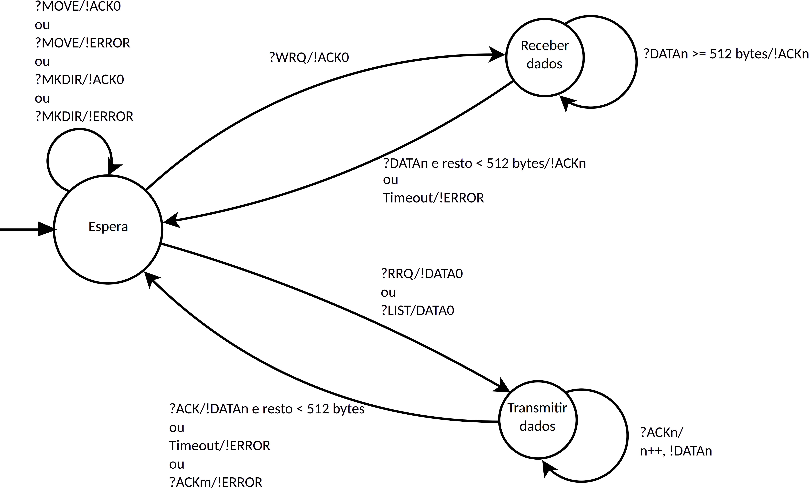

# Servidor TFTP (versão 2)

Este servidor TFTP possui as seguintes classes:

- Request
- DATA
- ACK
- ERROR
- TFTPServer
- Mensagem (ProtoBuffers)

No processo de lógica, é utilizada a máquina de estados finita comunicante abaixo:



A implementação da máquina de estados acima em *software* foi realizada utilizando utilizando as classes *Poller* e *Callback*, sendo criada a classe *TFTPServer* como uma especialização da classe *Callback*.

O laço que faz a máquina de estados funcionar é orquestrado pelo *Poller*, que chamada um método interno denominado `handle()`. É dentro deste método que a máquina de estados é implementada. O método `handle()` é chamado a cada iteração do descritor do *socket* UDP, que é o meio pelo qual as informações são transportadas.

Para tratar o *timeout*, é utilizado o método do *Poller* denominado `handle_timeout()`, que é chamado quando o *timeout* é atingido. Este método repete a última operação que exija resposta do cliente. O limite definido internamente é de três tentativas.

Além das mensagens padrão do protocolo TFTP, foram implementadas novas mensagens:

- list
- move
- mkdir

Tais mensagens foram implementadas utilizando o protocolo ProtoBuffers, que é um protocolo de serialização de dados binários. Todas operações que envolvem essas mensagens são realizadas utilizando os recursos do ProtoBuffers.

## Estados

Há quatro estados possíveis para o servidor:

 - Espera
 - Transmitir
 - Receber
 - Fim

### Espera

No estado de espera, o servidor aguarda a chegada de um pacote do cliente. Quando um pacote chega, o servidor verifica se o pacote é válido e, caso seja, verifica o tipo de operação requisitada. As operações são discriminadas de acordo com a mensagem recebida. Como esse servidor possui tanto a implementação das mensagens TFTP tradicionais quanto as mensagens do ProtoBuffers, ambos os tipos são validados assim que *bytes* são recebidos do cliente.

A classe `Request` é responsável por interpretar se a mensagem recebida é um RRQ ou WRQ, e a classe Mensagem é responsável por interpretar se a mensagem recebida é uma mensagem do ProtoBuffers.

Assim que a operação é corretamente identificada pelas mensagens, a máquina de estados muda para o estado que tratará cada caso.

Nesse estado, é possível gerar as seguintes mensagens de erro:

- 0: Not defined, see error message (if any).
- 4: Illegal TFTP operation.

#### RRQ

Uma mensagem é considerada um RRQ quando o código de operação identificado é 1. Em seguida, é realizada a verificação se o arquivo requisitado existe e se é acessível para leitura. Essa operação pode gerar diferentes mensagens de erro:

- 0: Not defined, see error message (if any).
- 1: File not Found.
- 2: Access Violation.

Caso não haja erros, o servidor manda o primeiro pacote DATA e muda para o estado "Transmitir".

#### WRQ

Uma mensagem é considerada um WRQ quando o código de operação identificado é 2. Em seguida, é realizada a verificação se o arquivo requisitado existe e se é acessível para escrita. Essa operação pode gerar diferentes mensagens de erro:

- 0: Not defined, see error message (if any).
- 2: Access Violation.
- 3: Disk full or allocation exceeded.
- 6: File already exists.

Caso não haja erros, o servidor muda para o estado "Receber".

#### LIST

Uma mensagem é considerada LIST quando o método `has_list()` retorna verdadeiro. O processo de recepcção e desserialização da mensagem é realizado da seguinte maneira:

 - Seja `buffer` um arranjo de *char* com capacidade de 512 *bytes*.
  
    ```c++
    sock.recv(buffer, sizeof(buffer), addr);
    string serializedMessage(buffer);
    desserializedMessage = new tftp2::Mensagem();
    desserializedMessage->ParseFromString(serializedMessage);
    ```

Com isso, é possível realizar a seguinte checagem:

```c++
if (desserializedMessage->has_list()){}
```
    
Caso seja solicitado um diretório que não existe, podem ocorrer as seguintes mensagens de erro:

- 0: Not defined, see error message (if any).
- 2: Access Violation.
- 8: File or parent directory does not exist.

O erro 8 indica que o diretório solicitado não existe.

Caso não ocorra nenhum erro, o servidor muda para o estado "Transmitir".

Nesse caso, no lugar de um arquivo, uma *string* serializada será transmitida. Essa *string* é tratada pela classe DATA, que receberá no construtor um parâmetro do tipo `tftp2::Mensagem`, conforme mostrado na declaração abaixo:

```c++
DATA(tftp2::Mensagem & message);
```

A lógica da listagem de arquivos foi implementada em um método privado:

```c++
int listDirectoryContents(string path, tftp2::ListResponse * listResponse);
```

O inteiro retornado é 0 quando houve sucesso e outros valores quando ocorreu algum erro. Esses valores são definidos na API POSIX. Para interpretar esses valores e gerar as mensagens de erro, foi criado o método privado:

```c++
ERROR* createErrorFromSysCallError(int errorNumber);
```

O retorno é um objeto da classe ERROR pronto para ser devolvido ao cliente.

#### MOVE

Uma mensagem é considerada MOVE quando o método `has_move()` retorna verdadeiro. O processo de recepcção e desserialização da mensagem ocorre da mesma maneira como ocorre na mensagem LIST.

Os possíveis erros são:

- 0: Not defined, see error message (if any).
- 8: File or parent directory does not exist.

Caso não ocorra nenhum erro, o servidor muda para o estado "Resultado".

#### MKDIR

Uma mensagem é considerada MKDIR quando o método `has_mkdir()` retorna verdadeiro. O processo de recepcção e desserialização da mensagem ocorre da mesma maneira como ocorre na mensagem LIST.

Os possíveis erros são:

- 0: Not defined, see error message (if any).
- 2: Access Violation.
- 3: Disk full or allocation exceeded.
- 5: File already exists.
- 8: File or parent directory does not exist.

Caso não ocorra nenhum erro, o servidor muda para o estado "Resultado".

### Transmitir

#### RRQ

Neste caso, o servidor aguarda o ACK do cliente e, caso o ACK seja recebido, o servidor manda o próximo pacote DATA. Caso o ACK não seja recebido, o servidor reenvia o último pacote DATA enviado. Esse processo é repetido até que a quantidade de dados a ser enviada seja menor que 512 bytes. Nesse caso, o servidor volta para o estado de Espera.

#### LIST

O processo ocorre de forma semelhante ao RRQ, porém, ao invés de enviar um arquivo, o servidor envia a *string* serializada do ProtocolBuffers. Toda essa parte é abstraída pela classe DATA, o que possibilitou que todos os mecanismos existentes anteriormente para o processo de envio de arquivo fossem reutilizados no envio da mensagem de resposta do ProtoBuffers.

### Receber

#### WRQ

Neste caso, o servidor aguarda o pacote DATA do cliente e, caso o pacote seja recebido, o servidor manda o ACK correspondente. Caso o pacote não seja recebido, o servidor reenvia o último ACK enviado. Esse processo é repetido até que a quantidade de dados a ser recebida seja menor que 512 bytes. Nesse caso, o servidor volta para o estado de Espera.

Os possíveis erros são:

- 0: Not defined, see error message (if any).
- 2: Access Violation.
- 3: Disk full or allocation exceeded.
- 6: File already exists.

### Resultado

Esse estado foi criado para as mensagens "MKDIR" e "MOVE", que retoram ou uma confirmação ACK ou uma mensagem de erro.

Os possíveis erros são:

- 0: Not defined, see error message (if any).
- 2: Access Violation.
- 3: Disk full or allocation exceeded.
- 8: File or parent directory does not exist.
- 9: Destination already exists and is directory.

## Classes

### Request

A classe `Request` é responsável por interpretar o pacote recebido do cliente e retornar o tipo de operação requisitada, o nome do arquivo e o modo de transferência.

O construtor da classe recebe como parâmetro um arranjo de *char* e a quantidade de bytes recebidos. O construtor possui a seguinte declaração:

```c++
 Request(char bytes[], size_t size);
```

Todos os *bytes* são segmentados nos atributos:

```c++
uint16_t opcode;
std::string filename;
std::string mode;
```

O método `getOpcode()` retorna o código de operação identificado, que permite selecionar a operação que será realizada, o método `getFilename()` retorna o nome do arquivo e o método `getMode()` retorna o modo de transferência.

### DATA

A classe `DATA` é responsável por montar o pacote DATA que será enviado ao cliente. Há quatro construtores disponíveis:

- Cria um pacote DATA vazio.
```c++
DATA();
```

- Cria um pacote DATA a partir de um arquivo, que será segmentado em pacotes de 512 *bytes*, sendo que o próximo segmento é obtido ao utilizar-se o método `increment()`
  
    ```c++
    DATA(const std::string & filename);
    ```

- Cria um pacote DATA a partir de um arranjo de *char* e a quantidade de *bytes*, geralmente usado quando o pacote é recebido do cliente.

    ```c++
    DATA(char bytes[], size_t size);
    ```

- Cria um pacote DATA a partir de um objeto da classe `tftp2::Mensagem`, usado na transmissão da mensagem de resposta serializada do ProtoBuffers.
  
    ```c++
    DATA(tftp2::Mensagem & message);
    ```

Há ainda os métodos `dataSize()`, que retorna o tamanho do que está armazenado na área de dados, o método `size()`, que retorna o tamanho do pacote em si, cujo valor máximo é 516 bytes e o mínimo é 4 bytes. Há ainda o método `getData()`, que retorna um ponteiro para a área de dados, o método `setBytes()`, que recebe um arranjo de *char* e a quantidade de *bytes*. Esse método é usado para receber o pacote do cliente. 

O método `increment()` possui diferentes lógicas para quando o objeto DATA foi construído usando uma *string* ou um arquivo.

Os métodos `getOpcode()` e `getBlockNumber()` retornam o código de operação e o número do bloco, respectivamente, e são usados na checagem se o pacote recebido é o correto e se o número do bloco é o esperado.

### ACK

A classe `ACK` é responsável por montar o pacote ACK que será enviado ao cliente. Há dois construtores disponíveis:

- Cria um pacote ACK vazio.
    ```c++
    ACK();
    ```

- Cria um pacote ACK a partir de um arranjo de *char*, geralmente usado quando o pacote é recebido do cliente.

    ```c++
    ACK(char bytes[]);
    ```

Há somente dois atributos privados:

```c++
uint16_t opcode;
uint16_t block;
```

Os métodos `getOpcode()` e `getBlockNumber()` retornam o código de operação e o número do bloco, respectivamente, e são usados na checagem se o pacote recebido é o correto e se o número do bloco é o esperado.

### ERROR

A classe `ERROR` é responsável por montar o pacote ERROR que será enviado ao cliente. Há três construtores disponíveis:

- Cria um pacote ERROR vazio.
    ```c++
    ERROR();
    ```

- Cria um pacote ERROR a partir do código de erro.

    ```c++
    ERROR(uint8_t errorCode);
    ```

- Cria um pacote ERROR a partir de um arranjo de *char*.

    ```c++
    ERROR(char bytes[], size_t size);
    ```

Como atributo privado, há um arranjo de *string* que contém as mensagens de erro:

```c++
string tftpErrorMessages[11] = { 
    "Not defined, see error message (if any).",
    "File not found.",
    "Access violation.",
    "Disk full or allocation exceeded.",
    "Illegal TFTP operation.",
    "Unknown transfer ID.",
    "File already exists.",
    "No such user.",
    "File or parent directory does not exists.",
    "The directory is not empty.",
    "Destination already exists and is a directory."
};
```

Dessa forma, novas mensagens de erro podem ser adicionadas conforme a necessidade.

O método `uint16_t getErrorCode();` permite obter o código numérico do erro e o método `string getErrorMessage();` permite obter a mensagem de erro correspondente.

### TFTPServer

A classe `TFTPServer` é responsável por orquestrar a máquina de estados finita comunicante. Essa classe é uma especialização da classe `Callback`, que é responsável por orquestrar o laço que faz a máquina de estados funcionar.

O construtor da classe recebe como parâmetro um *socket* UDP, um endereço de *socket*, um *timeout* e o diretório raiz do servidor.

```c++
TFTPServer(sockpp::UDPSocket & sock, sockpp::AddrInfo & addr, int timeout, string rootDirectory);
```

Conforme explicado anteriormente, o método `handle()` é responsável por orquestrar a máquina de estados. O método `handle_timeout()` é responsável por tratar o *timeout*.

Como forma de facilitar a implementação das novas mensagens, foram criados os métodos privados:

```c++
int createDirectory(string path);
int moveElement(string oldName, string newName);
int listDirectoryContents(string path, tftp2::ListResponse * listResponse);
ERROR* createErrorFromSysCallError(int errorNumber);
```

Os métodos `createDirectory()`, `moveElement()` e `listDirectoryContents()` são implementados utilizando a API POSIX. Dessa forma, os erros retornados são tratados pelo método `createErrorFromSysCallError()`, que os interpreta e retorna um objeto da classe ERROR pronto para ser enviado ao cliente.